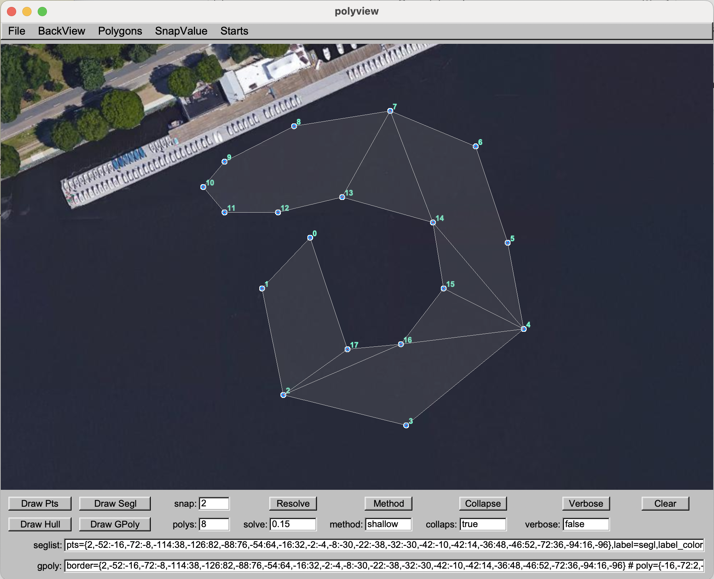

# moos-ivp-genpoly

|              |                            |
|:------------ |:-------------------------- |
| FILE:        | moos-ivp-genpoly/README.md |
| DATE:        | 2025/12/01                 |
| DESCRIPTION: | Contains info on the moos-ivp-genpoly repo. |


# Introduction

The moos-ivp-genpoly repository contains code for (a) representing general,
non-convex polygons, (b) algorithms for covering a genpoly with a set of
convex polygons, and (c) an engineering GUI for testing.

# Directory Structure

The directory structure for the moos-ivp-extend is described below:

| Directory        | Description                                 |
|:---------------- |:------------------------------------------- |
| bin              | Directory for generated executable files    |
| build            | Directory for build object files            |
| build.sh         | Script for building moos-ivp-extend         |
| CMakeLists.txt   | CMake configuration file for the project    |
| lib              | Directory for generated library files       |
| README           | Contains helpful information - (this file). |
| src              | Directory for source code                   |


# Build Instructions

## Linux and Mac Users

To build on Linux and Apple platforms, execute the build script within this
directory:

```bash
   $ ./build.sh
```

## Environment variables

The moos-ivp-genpoly binaries directory, **moos-ivp-genpoly/bin**
should be added to your path to allow them to be launched from
pAntler.

[//]: #====================================================================
# Using the code

The primary function of the moos-ivp-genpoly repo is contained within the
lib_gen_poly library. It contains:

(a) A data structure (C++ class) for representing a general polygon, and
(b) An algorithm for creating an genpoly from a sequence of vertices

An engineering GUI is also provided, app_polyview, for testing the creation
of genpolys from example sets of points. 

## Using the lib_genpoly library.

A general polygon is comprise of an ordered sequence of points, within an implied
line segment between each vertex, and such that no line segment crosses any other
line segment. This could be a regular polygon, e.g., square, hexagon, or any
convex polygon, or a non-convex polygon.

A non-convex polygon can have a covering. A covering is a set of convex polygon
that includes all vertices and space of of a nonconvex polygon. Generally, many
MOOS-IvP geometry library functions are defined over convex polyons. For example
rather than implmenting a function that computes the area of a general polygon,
we instead convert the general polygon into a set of convex polyongs first. Then
the area of the general polygon is just the sum of the areas of the covering
convex polygon.

The XYGenPolygon C++ class is comprised of two member variables. The ordered
list of vertices defining the general polygon, and one or more convex polygons
that cover the general polygon.

The non-trivial step is the creation of a minimal covering with the
lowest number of convex polyons. Finding the absolute minimal covering
is the goal, but for general polygons with many vertices, this can be
computationally expensive. A near minimal covering is often perfectly
fine. In the example above, for finding the area of a general polygon,
calculating the sum of say 20 convex polygons is exceptionally fast,
and not noticeably slower than "better" covering with 18
polygons. However, the search time between finding the covering of 20 vs.
the covering of 18 may be very substantial.

The C++ class, CoverEngine, is provided in this library for creating a
covering of a general polygon, with the following steps:

1. Create an instance of a CoverEngine
2. Initialize with a set of vertices
3. Invoke the genPolys() function
4. Extract the list of convex polygons
5. Return a XYGenPolygon instance with the vertices and polygons

[//]: #====================================================================
# Using polyview engineering GUI

The polyview app is an engineering GUI for devel/testing of the lib_genpoly
library. It can be launched simply with:

$ polyview

It should open a GUI with an empty waterspace at the MIT Sailing Pavilion.
The user can replace the background image and info file to be one of their
own choosing, and relaunch with:

$ polyview myfile.tif

This assumes there is a **myfile.tif** and **myfile.info** file in the directory
where this is being launched.

The user can then add/delete/insert vertices with the mouse button as follows:

* left mouse click drops a new vertex at the clicked location

* right mouse click removes the vertex closest to the clicked location. Note
this is ctrl-click on a Mac or on a system using a mouse with no right mouse
button.

* alt-left click will insert a new vertex between the two vertices closest
to the clicked location.



[//]: #--------------------------------------------------------------------
## Viewing Options

By default, the GUI will render:

* The individual points
* The ordered list (XYSegList) of points
* The convex hull of the set of points
* The covering of convex polygons

Each of these four draw routines can be toggled on/off with the corresponding
buttons on the lower lefthand side of the GUI.


[//]: #--------------------------------------------------------------------
## Pre-loaded Start Points

The user can assemble their own start points, or use a number of pre-loaded
start configurations, through the Starts pull-down menu. Or the short-cut keys
1-8 can be used to load the start configurations


# END of README

